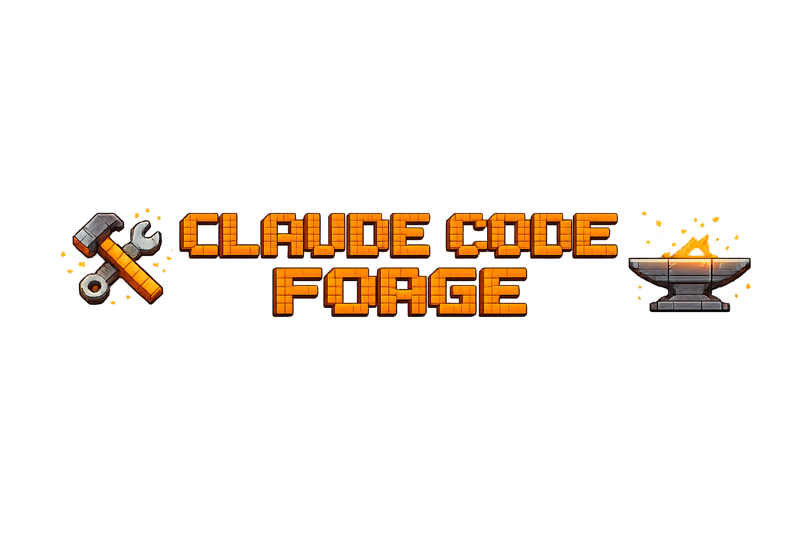

<div align="center">



<br>

**Stop prompting. Start engineering.**

Claude Code is powerful out of the box. But left unconfigured, it hallucinates structure,<br>
ignores long instructions, and treats every user the same. The forge fixes that.

[](https://github.com/nickt92/claude-code-forge/actions/workflows/test.yml)
[](LICENSE)
[](https://docs.anthropic.com/en/docs/claude-code)
[](#persona-system)
[](#credits)

**`forge` CLI** · **12 Personas** · **3 Plugin Groups** · **8 Hooks** · **7 Rules Files** · **380+ Tests**

</div>

## The Problem

Claude Code reads instructions — but doesn't always follow them. Through empirical testing:

> **Long files lose adherence.** Content buried at line 200+ gets ignored. The forge assembles focused CLAUDE.md files under 200 lines — every time.

> **Passive language is treated as optional.** "Consider accessibility" is a suggestion. "Apply to ALL frontend work" is a command. The forge uses imperative, tested phrasing throughout.

> **Knowing the rules ≠ following them.** Hooks create forcing functions that block non-compliant behavior at write time — not just at read time.

> **One size doesn't fit all.** A product manager doesn't need tier classifications and agent names. A senior engineer does. Same quality standards, different communication.

## Quick Start

### Prerequisites

- [Claude Code CLI](https://docs.anthropic.com/en/docs/claude-code) installed
- `jq` installed (`brew install jq` on macOS, `apt install jq` on Linux)
- macOS, Linux, or Windows (Git Bash — ships with [Git for Windows](https://gitforwindows.org/))

### Install

```bash
git clone https://github.com/nickt92/claude-code-forge.git
cd claude-code-forge
chmod +x install.sh
./install.sh
```

The installer walks you through persona selection, then:

1. Assembles a tailored CLAUDE.md from section files (verified under 200 lines)
2. Backs up your existing `~/.claude/` configuration automatically
3. Copies rules files, hooks, scripts, and status line
4. Merges settings additively — your existing hooks and plugins are preserved
5. Installs specialist plugins for your chosen plugin group
6. Runs health checks and assembly smoke tests
7. Symlinks the `forge` CLI to `~/.claude/bin/forge`

### Verify

```bash
forge doctor        # Health check
claude              # Start a new session
/memory             # Confirm files are loaded
```

### PATH Setup (optional but recommended)

Add `~/.claude/bin` to your PATH so `forge` is available anywhere:

```bash
# Add to ~/.zshrc or ~/.bashrc
export PATH="$HOME/.claude/bin:$PATH"
```

## forge CLI

The `forge` CLI is a command dispatcher with dedicated, documented subcommands. `install.sh` still works as a thin wrapper that calls `forge install "$@"`.

```
forge <command> [options]

Setup
  install     Install or reinstall forge to ~/.claude/
  build       Create a custom persona profile
  init        Initialize per-project forge config

Management
  switch      Switch to a different persona
  update      Update forge from source repository

Diagnostics
  status      Show current installation status
  doctor      Run diagnostic health checks
  diff        Show differences between source and installed

Info
  version     Show forge version
  help        Show this help
```

Run `forge <command> --help` for command-specific options.

### forge install

Full install or reinstall. Runs the persona wizard when called interactively; accepts flags for scripted use.

```bash
forge install                              # Interactive wizard
forge install --profile senior-engineer   # Non-interactive
forge install --plugins minimal           # Override plugin group
forge install --reconfigure               # Re-run persona wizard
forge install --uninstall                 # Remove forge, restore backups
forge install --check                     # Health checks only (no changes)
forge install --dry-run --profile senior-engineer  # Preview without changes
forge install --quiet --profile vibe-coder  # Minimal output (CI-friendly)
forge install --debug                     # Verbose trace

# install.sh delegates to forge install — same flags work:
./install.sh --profile senior-engineer
```

**`--check`** runs health checks against the existing `~/.claude/` installation without modifying anything. Useful after pulling repo changes to see what's out of date.

**`--reconfigure`** always runs the wizard, even if a profile is already installed.

**`--uninstall`** shows a preview before prompting for confirmation. Optionally removes plugins too.

**`--dry-run`** shows exactly what would be installed — profile, rules, hooks, plugins — without creating or modifying any files.

**`--plugins <group>`** overrides the persona's default plugin group. See [Plugin Groups](#plugin-groups) below.

### forge switch

Switch persona without a full reinstall. Reassembles `~/.claude/CLAUDE.md` and updates `profile.json` in seconds. Hooks read `profile.json` at runtime — the new persona takes effect on the next `claude` session.

```bash
forge switch senior-engineer
forge switch vibe-coder
forge switch custom-my-team    # Custom personas from forge build
forge switch                   # List available personas
```

### forge doctor

Diagnostic health checks across 7 categories. Shows pass/warn/fail per check with actionable messages.

```bash
forge doctor
```

Categories checked:

| Category | What It Checks |
|:---------|:---------------|
| **Manifest** | Validity, version match, schema version |
| **File Integrity** | Rules, hooks, scripts, lib, statusline present and unmodified |
| **Hook Configuration** | All 8 hooks wired in settings.json |
| **CLAUDE.md** | Matches current profile (content diff against live assembly) |
| **Plugins** | Count matches expected for installed plugin group |
| **CLI** | forge symlink valid and executable |

### forge update

Fetches from origin, fast-forward merges, then reinstalls with your current persona and plugin group. Fails safely on diverged history or uncommitted changes in the source repo.

```bash
forge update
```

### forge status

Shows current installation status at a glance — persona, plugin group, version, hooks, install timestamp, and source directory.

```bash
forge status
```

### forge diff

Compares source tree against installed `~/.claude/` files. Shows added, changed, and removed files by category (Rules, Hooks, Scripts, Root Files, Lib Files, CLAUDE.md). Use this to preview what `forge update` will change.

```bash
forge diff
```

### forge build

Interactive wizard to create a custom persona profile. Walks through the 4 behavioral axes, quality standards, and plugin group selection. Saves the profile to `~/.claude/profiles/custom-<name>.json` and optionally switches to it immediately.

```bash
forge build
```

Custom profiles are usable immediately with `forge switch` and `forge install --profile`.

### forge init

Per-project configuration. Creates a `.claude/` directory in the current working directory with an assembled CLAUDE.md and rules files. Does **not** modify `~/.claude/` or install hooks (hooks are global).

```bash
forge init                           # Uses current global persona
forge init --persona senior-engineer # Specify a persona
```

Useful for monorepos or projects where you want project-level Claude instructions committed alongside the code.

## Plugin Groups

Each persona has a default plugin group; you can override it with `--plugins` at install time.

| Group | Plugins | Default for |
|:------|--------:|:------------|
| **full** | 18 | senior-engineer, cto-architect, devops-engineer, data-engineer, data-scientist |
| **standard** | 16 | analyst, junior-dev, designer (drops HR/legal and startup plugins) |
| **minimal** | 6 | vibe-coder, hobbyist, executive, product-manager |

**full** includes every plugin in the workflow suite plus both Anthropic plugins.

**standard** drops `hr-legal-compliance` and `startup-business-analyst` — not useful for most day-to-day engineering work.

**minimal** includes only the essential six: `debugging-toolkit`, `comprehensive-review`, `error-debugging`, `code-refactoring`, `context7`, and `frontend-design`.

Override at install time:

```bash
forge install --profile senior-engineer --plugins standard
forge install --profile vibe-coder --plugins full
```

The installed group is recorded in the manifest. `forge doctor` and `forge update` use it to validate and reinstall the correct set.

## What Gets Installed

The forge writes only to `~/.claude/`. Before touching anything, it snapshots your existing configuration to `~/.claude/forge-backup/`. `forge install --uninstall` reads that snapshot and restores exactly what was there before.

```
~/.claude/
├── CLAUDE.md                     # Assembled from your persona (replaces existing)
├── profile.json                  # Your persona config (hooks read this at runtime)
├── statusline-command.sh         # Status line script
├── settings.json                 # Forge hooks + plugins merged into existing config
├── bin/
│   └── forge -> <source>/forge   # Symlink — always current, no copy to go stale
├── rules/
│   ├── agent-orchestration.md   # 4-phase workflow, specialist routing table
│   ├── commit-and-delivery.md   # Commit format, dependency policy
│   ├── context-and-memory.md    # Session resumption, compaction protection
│   ├── project-setup.md         # Document chain, project onboarding
│   ├── pull-requests.md         # PR format standards
│   ├── quality-engineering.md   # Testing pyramid, coverage targets, accessibility
│   └── scope-discipline.md      # Task classification guard rails
├── hooks/
│   ├── session-init.sh          # First-prompt nudge (persona-aware)
│   ├── architect-gate.sh        # Blocks plan files without architect review
│   ├── commit-validator.sh      # Blocks AI attribution, warns on bad format
│   ├── backup-transcript.sh     # Saves transcript before context compaction
│   ├── command-guard.sh         # Blocks destructive commands
│   ├── secret-filter.sh         # Detects credentials in commands
│   ├── db-guard.sh              # Blocks destructive SQL
│   └── forge-update-check.sh    # Advisory version check
├── scripts/
│   ├── generate-project-claude.sh  # Brownfield project onboarding
│   └── init-project-claude.sh      # Greenfield project setup
├── completions/
│   ├── forge.bash               # Bash tab completion
│   └── forge.zsh                # Zsh tab completion
├── profiles/                    # User-space custom personas (from forge build)
├── lib/
│   └── ui.sh                    # Shared output library (used by scripts and forge)
└── forge-backup/
    ├── manifest.json             # What was backed up and what was installed
    ├── CLAUDE.md                 # Your original CLAUDE.md (if any)
    ├── settings.json             # Your original settings.json (if any)
    └── rules/, hooks/, ...       # Any pre-existing files in these directories
```

**The forge symlink** — `~/.claude/bin/forge` points directly to the source tree. When you pull new changes, `forge` is immediately updated without reinstalling. `forge diff` and `forge update` use this to compare installed files against the current source.

**Settings merge strategy** — Hooks and plugins are added additively. The forge never removes your existing hooks or plugins. `statusLine` and `alwaysThinkingEnabled` are set by the template. All other keys in your `settings.json` are preserved unchanged.

**Uninstall is clean.** The manifest records exactly which files were installed and which were pre-existing. `forge install --uninstall` restores pre-existing files, removes forge-only files, and surgically unmerges forge additions from `settings.json` — including any plugins or hooks you added after installation.

## Persona System

The forge uses an **axis-based persona system**. Each persona selects values from 4 behavioral axes. The installer reads the selection and assembles a tailored CLAUDE.md from reusable section files — 15 section files serve any number of personas without content drift.

### The 4 Axes

| Axis | Values | What It Controls |
|:-----|:-------|:----------------|
| **Communication** | `plain` · `technical` · `expert` | Jargon level, explanation depth, analogies |
| **Autonomy** | `guided` · `moderate` · `high` | How often Claude asks vs proceeds |
| **Workflow** | `simplified` · `standard` · `advanced` | Internal ceremony visibility |
| **Depth** | `conceptual` · `practical` · `engineering` | Code-level detail in explanations |

### 12 Personas

Every persona enforces the same quality standards — the same architect reviews, security audits, and testing gates run regardless of which persona you pick. What changes is how Claude **talks to you**: the jargon level, how much it explains its process, and whether it surfaces internal workflow details or keeps them behind the scenes.

> **Important:** The forge controls Claude's *instructions*, not the Claude Code client. You'll still see the same tool calls, permission prompts, and file diffs regardless of persona — that's the Claude Code runtime UI and can't be changed. What changes is how Claude explains and narrates its work in its text responses.

**Non-technical** — plain language, step-by-step guidance, internal workflow translated into everyday terms

| Persona | How Claude communicates |
|:--------|:-----------------------|
| **Product Manager** | Business language, decisions framed as trade-offs |
| **Executive** | High-level summaries, strategic framing |
| **Vibe Coder** | Casual, minimal jargon, just shows results |

**Technical** — domain terminology, balanced guidance, workflow visible but not verbose

| Persona | How Claude communicates |
|:--------|:-----------------------|
| **Designer (UI/UX)** | Design-aware language, accessibility context |
| **Data Analyst** | Data terminology, explains analytical reasoning |
| **Data Scientist** | Statistical/ML vocabulary, engineering detail |
| **Junior Developer** | Technical but explanatory, more "why" behind decisions |
| **Hobbyist** | Approachable, explains patterns as they come up |

**Engineering** — expert shorthand, high autonomy, full workflow and agent orchestration visible

| Persona | How Claude communicates |
|:--------|:-----------------------|
| **Senior Engineer** | Peer-level, terse, leads with recommendations |
| **CTO / Architect** | Architectural framing, trade-off analysis |
| **DevOps / Platform** | Infra-native terminology, operational context |
| **Data Engineer** | Pipeline/systems vocabulary, engineering depth |

> Personas sharing identical axis values produce the same CLAUDE.md — the label is for wizard UX. Pick the one that fits. Or run `forge build` to create your own.

### The Key Insight: Interpretation Directive

For non-technical personas, the workflow section includes an **interpretation directive** — Claude follows the same engineering rules internally but adapts how it communicates:

| What happens internally | What the vibe coder sees |
|:------------------------|:-------------------------|
| "Significant-tier task, Phase 1 design gate" | "Here's my proposed approach" |
| "Invoking security-auditor agent" | "I'm reviewing this for security" |
| "Architect review approved with changes" | "I've refined the approach — here's what changed" |

Quality is identical. Jargon is not.

### Adding a Persona

Create one JSON file in `templates/profiles/`. If existing axis values cover the behavior, zero section changes are needed.

<details>
<summary><strong>Example: custom persona JSON</strong></summary>

```json
{
  "schema_version": 1,
  "persona": "custom-ml-engineer",
  "label": "ML Engineer (Custom)",
  "description": "Custom persona built with forge build",
  "axes": {
    "communication": "expert",
    "autonomy": "high",
    "workflow": "advanced",
    "depth": "engineering"
  },
  "quality": ["core", "engineering"],
  "default_plugin_group": "full"
}
```

</details>

Or use `forge build` for an interactive wizard that generates the JSON and validates it.

## The 4-Phase Workflow

Every task follows a structured workflow, with rigor proportional to complexity:

```
Phase 1 — Design     (significant tasks only)
Phase 2 — Implement  (all tasks)
Phase 3 — Review     (all tasks, scope varies by tier)
Phase 4 — React      (on-demand: errors, incidents, debugging)
```

### 3-Tier Task Classification

| Tier | Criteria | What Happens |
|:-----|:---------|:-------------|
| **Trivial** | Single-file, clear requirements | Implement directly, code review before commit |
| **Moderate** | Multi-file, well-understood domain | Implement, domain architect + code review |
| **Significant** | New service, auth, architecture | Plan mode → architect review → approval → implement |

### Hooks

| Hook | Trigger | What It Does |
|:-----|:--------|:-------------|
| `session-init.sh` | First prompt per session | Persona-aware classification nudge |
| `architect-gate.sh` | Write/Edit tools | Blocks plan files without `## Architect Review` section |
| `commit-validator.sh` | Bash tool (git commit) | Blocks AI attribution, warns on non-conventional format |
| `backup-transcript.sh` | Before compaction | Saves full transcript to `~/.claude/backups/` |
| `command-guard.sh` | Bash tool | Blocks destructive commands (`rm -rf /`, `docker --privileged`) |
| `secret-filter.sh` | Bash tool | Detects credentials in commands (AWS keys, tokens) |
| `db-guard.sh` | Bash tool | Blocks destructive SQL (`DROP TABLE`, `DELETE` without `WHERE`) |
| `forge-update-check.sh` | First prompt per session | Advisory notice when forge version is outdated |

See [SECURITY.md](SECURITY.md) for the security model and known limitations.

## Status Line

```
🌿 feat/thing ✦3 ↑2 │ 🧠 Opus │ ▐████░░░░▌ 42% │ 💰 38¢ │ ✏️ +156 −23 │ ⏱️ 12m
```

| Segment | What It Shows |
|:--------|:-------------|
| **Branch** | Git branch, dirty count, ahead/behind, stashes |
| **Model** | Active model (color-coded: Opus=red, Sonnet=cyan, Haiku=green) |
| **Context** | Context window usage bar (green <70%, yellow 70-90%, red >90%) |
| **Cost** | Session cost |
| **Changes** | Lines added/removed |
| **Time** | Session duration |

## Project Onboarding

### Brownfield (Existing Projects)

Analyzes your codebase and generates a project-level CLAUDE.md — not a template with blanks, but a real analysis of your architecture, tech stack, patterns, and pitfalls.

```bash
cd /path/to/your-existing-project
~/.claude/scripts/generate-project-claude.sh
```

### Greenfield (New Projects)

Interactive setup that helps you make architectural decisions and generates the CLAUDE.md before the first line of code.

```bash
mkdir my-new-project && cd my-new-project && git init
~/.claude/scripts/init-project-claude.sh
```

### Per-Project with `forge init`

For projects where you want Claude instructions version-controlled alongside the code:

```bash
cd /path/to/project
forge init                             # Uses your current global persona
forge init --persona senior-engineer  # Or specify one explicitly
```

This creates `.claude/CLAUDE.md` and `.claude/rules/` in your project directory. Hooks and plugins remain global — only the instructions and rules are project-scoped.

### Document Chain (Optional)

For multi-session or multi-phase projects, the forge supports a **document chain** — structured files that give Claude persistent context about your project's vision, requirements, and progress:

```
your-project/
├── CLAUDE.md         # Project-level Claude instructions (always)
├── PROJECT.md        # Vision, goals, constraints, stakeholders
├── REQUIREMENTS.md   # Scoped requirements with acceptance criteria
└── ROADMAP.md        # Phased plan with progress tracking
```

These are team artifacts committed to git. Claude checks for them at session start and offers to help generate them when you describe new work. Templates are in `templates/document-chain/` and filled-in examples are in `examples/document-chain/`.

## Customization

<details>
<summary><strong>Adjusting Quality Standards</strong></summary>

Edit `templates/rules/quality-engineering.md`:
- Change coverage targets (default: 85%)
- Add or remove accessibility requirements
- Adjust performance checklists

Then run `forge install` to install the updated rules.

</details>

<details>
<summary><strong>Project-Level Overrides</strong></summary>

Copy `examples/project-CLAUDE.md` to your project root as `CLAUDE.md`. Project-level instructions override global for project-specific concerns (tech stack, patterns, conventions). The global `~/.claude/CLAUDE.md` still applies for everything not overridden.

</details>

<details>
<summary><strong>Adding Custom Agents</strong></summary>

The plugin system supports any specialist. Add agents to `templates/rules/agent-orchestration.md` in the appropriate phase and update the domain architect routing table. Run `forge install` to propagate changes.

</details>

<details>
<summary><strong>Building a Custom Persona</strong></summary>

```bash
forge build
```

This walks you through the 4 axes, quality settings, and plugin group selection, then saves a `custom-<name>.json` profile. Switch to it immediately or install it later:

```bash
forge switch custom-my-team
forge install --profile custom-my-team
```

</details>

## Troubleshooting

<details>
<summary><strong>Health check fails after install</strong></summary>

Run `forge doctor` to see exactly which checks are failing. Common causes:

- **Missing hooks or rules files** — run `forge install` to reinstall
- **Hooks not executable** — the installer sets `chmod +x` on all hooks; if this fails, set manually: `chmod +x ~/.claude/hooks/*.sh`
- **Plugin count below expected** — the `claude plugins add` command occasionally fails silently on a bad network. Run `forge install` to retry plugin installation
- **Version mismatch** — if `forge doctor` shows installed ≠ source, run `forge update` or `forge install` to sync

</details>

<details>
<summary><strong>Claude doesn't seem to be following the rules</strong></summary>

Run `/memory` at the start of a Claude session. If `~/.claude/CLAUDE.md` and the rules files are not listed, Claude isn't loading them.

Three things to verify:
1. `~/.claude/CLAUDE.md` exists and is under 200 lines (`wc -l ~/.claude/CLAUDE.md`)
2. `~/.claude/rules/` contains the 7 rules files
3. Claude Code version is 1.0 or newer (`claude --version`)

If the files are loaded but rules aren't followed, check that you're at the start of a fresh session. Long-running sessions accumulate context and can lose instruction adherence — start a new session with `/clear` or open a new terminal.

</details>

<details>
<summary><strong>forge: command not found</strong></summary>

The forge symlink is installed at `~/.claude/bin/forge`. Add that directory to your PATH:

```bash
export PATH="$HOME/.claude/bin:$PATH"
```

Or call it directly:

```bash
~/.claude/bin/forge doctor
```

You can also run `forge` from the source directory directly — the `forge` script at the root of the repo works standalone.

</details>

<details>
<summary><strong>The architect-gate hook is blocking my file</strong></summary>

The hook blocks writes to `~/.claude/plans/` that don't include an `## Architect Review` section. This is intentional — the gate enforces that you run the domain architect agent before finalizing a plan.

To pass the gate, add the section to your plan file:

```markdown
## Architect Review
- **Reviewer:** backend-development:backend-architect
- **Verdict:** approved
- **Key findings:** ...
- **Adjustments:** none
```

If you're writing a plan outside `~/.claude/plans/`, the hook doesn't apply.

</details>

<details>
<summary><strong>commit-validator is blocking my commit</strong></summary>

The validator blocks commits containing AI attribution (`Co-Authored-By: Claude`, `Generated with Claude Code`, etc.). Remove the attribution and commit again.

It also warns (but does not block) on non-conventional commit format. The expected format is:

```
feat(scope): description
fix(auth): description
chore(deps): description
```

If you see a warning but want to proceed, the commit still goes through — the warning is informational.

</details>

<details>
<summary><strong>I already have hooks or plugins configured</strong></summary>

The settings merge is additive. The forge appends its hooks to your existing hook arrays and adds its plugins to your existing plugin object. Your hooks and plugins are never removed.

If you're concerned about conflicts, check `~/.claude/forge-backup/manifest.json` — the `installed.settings_additions` field shows exactly what the forge added to your `settings.json`.

</details>

<details>
<summary><strong>--uninstall didn't restore my original settings.json</strong></summary>

Uninstall reads `~/.claude/forge-backup/manifest.json` to determine what to restore. If the manifest is missing (e.g., it was deleted manually), uninstall falls back to best-effort removal using the known forge file list.

If you had a custom `settings.json` before installing, the original is in `~/.claude/forge-backup/settings.json`. You can restore it manually:

```bash
cp ~/.claude/forge-backup/settings.json ~/.claude/settings.json
```

</details>

<details>
<summary><strong>WSL or Linux: colors or spinner look broken</strong></summary>

The UI library auto-detects TTY and color support. If output looks garbled, disable colors:

```bash
NO_COLOR=1 forge install --profile senior-engineer
```

On non-interactive environments (CI, pipes), the spinner and progress counter automatically fall back to plain text output.

</details>

## Testing

380+ automated tests using [bats-core](https://github.com/bats-core/bats-core), run on every push via GitHub Actions (macOS + Ubuntu).

```bash
./test/run_tests.sh              # Run all tests
./test/run_tests.sh unit         # Hook and CLI unit tests
./test/run_tests.sh integration  # Assembly, merge, install flow, new subcommands
./test/run_tests.sh validation   # Profile schema, section coverage
```

> **Note:** bats-core is included as a git submodule. If the test runner fails to find it, run `git submodule update --init --recursive` first.

| Suite | Files | What It Covers |
|:------|------:|:---------------|
| **Unit** | 10 | Commit validator, architect gate, session init, backup transcript, platform detection, UI library, plugins, manifest v2, forge CLI dispatcher, status |
| **Integration** | 10 | Assembly pipeline, settings merge/unmerge, install flow, backup and restore, switch, doctor, diff, update, build, init |
| **Validation** | 4 | Profile schema integrity, section file coverage, settings template structure, shell completions |

All tests run in a sandbox (`$HOME` redirected to a temp directory) — your real `~/.claude/` is never touched.

## Design Decisions

<details>
<summary><strong>Why a forge CLI instead of just install.sh flags?</strong></summary>

`install.sh` flags worked for a single command, but as operations multiplied (switch persona, run doctor, compare files, update, build custom personas), a flat flag namespace became unmanageable. The `forge` CLI groups related operations, provides consistent `--help` per subcommand, and is extensible — adding a new command is one `lib/cmd-<name>.sh` file.

`install.sh` is kept as a compatibility wrapper so existing documentation, scripts, and muscle memory continue to work.

</details>

<details>
<summary><strong>Why a symlink instead of copying the forge binary?</strong></summary>

A symlink to the source tree means `forge` is always the current version after a `git pull`, without requiring a reinstall to pick up CLI changes. `forge diff` detects when installed *files* differ from source, but the CLI itself is always current. The tradeoff is that the source repo must remain at the same path — relocating it requires a `forge install` to refresh the symlink.

</details>

<details>
<summary><strong>Why plugin groups instead of all-or-nothing?</strong></summary>

18 plugins is the right set for an engineering persona. It's excessive for a vibe coder who just wants to build things without managing HR compliance agents. Tiered groups let each persona install what it actually needs, keep `claude plugins` clean, and reduce the chance of irrelevant agents surfacing in completions.

</details>

<details>
<summary><strong>Why hooks instead of just instructions?</strong></summary>

Instructions tell Claude what to do. Hooks enforce it. The `architect-gate` hook literally blocks plan file writes that don't include an `## Architect Review` section. Claude can't skip the step even if it wants to. The `commit-validator` hook blocks AI attribution at the moment of commit — not as a reminder to remember later.

</details>

<details>
<summary><strong>Why under 200 lines per CLAUDE.md?</strong></summary>

Anthropic recommends it. Our testing showed content at line 200+ was frequently ignored in long sessions. The persona system guarantees every assembled CLAUDE.md stays under the limit — the health check verifies all profiles at install time.

</details>

<details>
<summary><strong>Why axis-based personas instead of separate templates?</strong></summary>

15 section files serve any number of personas. Adding a persona is one JSON file, not duplicating and maintaining a full CLAUDE.md template. When you update a section file, every persona that uses it gets the update automatically on the next install.

</details>

<details>
<summary><strong>Why is the backup manifest-based instead of timestamped copies?</strong></summary>

Timestamped backups accumulate and require manual cleanup. The manifest takes a single snapshot on first install and freezes it — reinstalls don't overwrite the original backup, so you always have a clean restore point regardless of how many times you update. The manifest also records what the forge added to `settings.json` so uninstall can be surgical rather than destructive.

</details>

## Maintenance

```bash
forge status                              # Current persona, version, hooks at a glance
forge doctor                              # Check current installation health
forge diff                                # Preview what forge update would change
forge update                              # Pull latest and reinstall
forge switch <persona>                    # Change persona without full reinstall
forge install --check                     # Health checks only
du -sh ~/.claude/backups/                 # Check transcript backup size
find ~/.claude/backups/ -mtime +30 -delete  # Clean old transcripts
claude plugins update                     # Update plugins independently
```

## Credits

Built through iterative testing and refinement with Claude Code itself — patterns that survived contact with actual codebases, not theoretical best practices.

### Agent Plugins

**[agents](https://github.com/wshobson/agents)** by [Seth Hobson](https://github.com/wshobson) — 72 plugins providing 112+ specialist agents that make the 4-phase workflow possible. Without this project, there would be no architect review gate, no domain-specific routing, no code reviewer quality gate.

**[claude-code-plugins](https://github.com/anthropics/claude-code-plugins)** by Anthropic — official plugins:
- `context7` — real-time library documentation lookup
- `frontend-design` — UI/UX design quality for frontend work

### Tools

- [Claude Code](https://docs.anthropic.com/en/docs/claude-code) by Anthropic

## License

MIT
